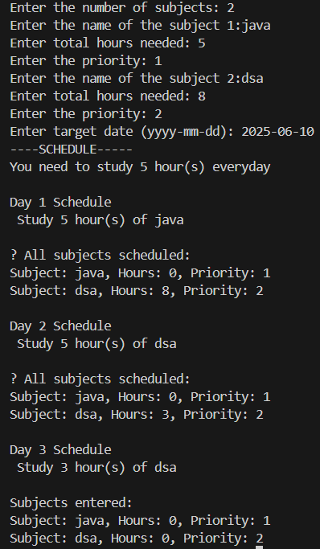

# IntelliPlanner – Smart Study Scheduler 🧠📅

A Java-based study planner that helps students schedule their subjects based on total hours, priority, and target exam date.

## 💡 Features
- Takes subject name, required study hours, and priority as input
- Calculates how many hours to study daily based on target exam date
- Automatically distributes the workload
- Displays day-by-day schedule
- Built using core Java and OOP principles

## 📷 Sample Output

## 🛠️ Technologies
- Java
- ArrayList
- OOP (Classes & Objects)
- Date & Time (LocalDate)

## 🚀 Future Plans
- Add file saving/loading
- Build a GUI using JavaFX
- Turn into a web app using HTML/JavaScript

---

